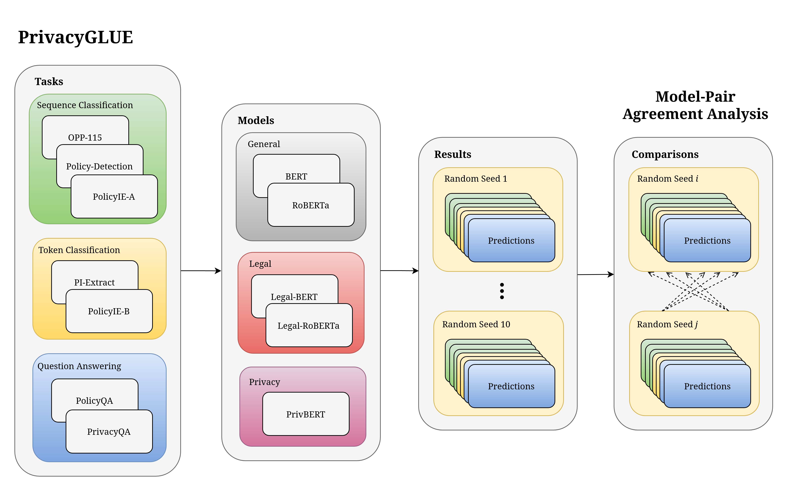

# PrivacyGLUE: A Benchmark Dataset for General Language Understanding in Privacy Policies

<p align="center">

</p>

PrivacyGLUE is the first comprehensive privacy-oriented NLP benchmark comprising 7 relevant and high-quality privacy tasks for measuring general language understanding in the privacy language domain. We release performances from the BERT, RoBERTa, Legal-BERT, Legal-RoBERTa and PrivBERT pretrained language models and perform model-pair agreement analysis to detect examples where models benefited from domain specialization. Our findings show that PrivBERT, the only model pretrained on privacy policies, outperforms other models by an average of 2–3% over all PrivacyGLUE tasks, shedding light on the importance of in-domain pretraining for privacy policies.

This repository functions as the official codebase for reproducing the PrivacyGLUE benchmark reported in our MDPI Applied Sciencies [paper](https://www.mdpi.com/2076-3417/13/6/3701) with citation information found [here](#Citation-classical_building). Additional information on the PrivacyGLUE tasks can be found in [here](#Tasks-runner). We direct readers to our paper for further details on our methodologies and results.

## Dependencies :mag:

1. This repository was tested against Python version `3.8.13` and CUDA version `11.7`. Create a virtual environment with the same python version and install dependencies with [`poetry`](https://python-poetry.org/):

    ```
    $ poetry install
    ```

    Alternatively, install dependencies in the virtual environment using `pip`:
    ```
    $ pip install -r requirements.txt
    ```

2.  Install Git [`LFS`](https://git-lfs.github.com/) to access upstream task data. We utilized version `3.2.0` in our implementation.

3. **Optional:** To further develop this repository, install [`pre-commit`](https://github.com/pre-commit/pre-commit) to setup pre-commit hooks for code-checks.

## Initialization :fire:

1. To prepare git submodules and data, execute:

    ```
    $ bash scripts/prepare.sh
    ```

2. **Optional:** To install pre-commit hooks for further development of this repository, execute:

    ```
    $ pre-commit install
    ```

## Tasks :runner:

| Task             | Type                                | Study                                                                                |
|:-----------------|:------------------------------------|:-------------------------------------------------------------------------------------|
| OPP-115          | Multi-label sequence classification | [Wilson et al. (2016)](https://usableprivacy.org/data)<sup>\*</sup>                  |
| PI-Extract       | Multi-task token classification     | [Duc et al. (2021)](https://github.com/um-rtcl/piextract_dataset)                    |
| Policy-Detection | Binary sequence classification      | [Amos et al. (2021)](https://privacypolicies.cs.princeton.edu/)                      |
| PolicyIE-A       | Multi-class sequence classification | [Ahmad et al. (2021)](https://github.com/wasiahmad/PolicyIE)                         |
| PolicyIE-B       | Multi-task token classification     | [Ahmad et al. (2021)](https://github.com/wasiahmad/PolicyIE)                         |
| PolicyQA         | Reading comprehension               | [Ahmad et al. (2020)](https://github.com/wasiahmad/PolicyQA)                         |
| PrivacyQA        | Binary sequence classification      | [Ravichander et al. (2019)](https://github.com/AbhilashaRavichander/PrivacyQA_EMNLP) |

<sup>\*</sup>Data splits were not defined in Wilson et al. (2016) and were instead taken from [Mousavi et al. (2020)](https://github.com/SmartDataAnalytics/Polisis_Benchmark)

## Usage :snowflake:

We use the `run_privacy_glue.sh` script to run PrivacyGLUE benchmark experiments:

```
usage: run_privacy_glue.sh [option...]

optional arguments:
  --cuda_visible_devices       <str>
                               comma separated string of integers passed
                               directly to the "CUDA_VISIBLE_DEVICES"
                               environment variable
                               (default: 0)

  --fp16                       enable 16-bit mixed precision computation
                               through NVIDIA Apex for training
                               (default: False)

  --model_name_or_path         <str>
                               model to be used for fine-tuning. Currently only
                               the following are supported:
                               "bert-base-uncased",
                               "roberta-base",
                               "nlpaueb/legal-bert-base-uncased",
                               "saibo/legal-roberta-base",
                               "mukund/privbert"
                               (default: bert-base-uncased)

  --no_cuda                    disable CUDA even when available (default: False)

  --overwrite_cache            overwrite caches used in preprocessing
                               (default: False)

  --overwrite_output_dir       overwrite run directories and saved checkpoint(s)
                               (default: False)

  --preprocessing_num_workers  <int>
                               number of workers to be used for preprocessing
                               (default: None)

  --task                       <str>
                               task to be worked on. The following values are
                               accepted: "opp_115", "piextract",
                               "policy_detection", "policy_ie_a", "policy_ie_b",
                               "policy_qa", "privacy_qa", "all"
                               (default: all)

  --wandb                      log metrics and results to wandb
                               (default: False)

  -h, --help                   show this help message and exit
```

To run the PrivacyGLUE benchmark for a supported model against all tasks, execute:

```
$ bash scripts/run_privacy_glue.sh --cuda_visible_devices <device_id> \
                                   --model_name_or_path <model> \
                                   --fp16
```

**Note**: Replace the `<device_id>` argument with a GPU ID or comma-separated GPU IDs to run single-GPU or multi-GPU fine-tuning respectively. Correspondingly, replace the `<model>` argument with one of our supported models listed in the usage documentation above.

## Notebooks :book:

We utilize the following `ipynb` notebooks for analyses outside of the PrivacyGLUE benchmark:

| Notebook                                                                         | Description                                                                                           |
|:---------------------------------------------------------------------------------|:------------------------------------------------------------------------------------------------------|
| [visualize_domain_embeddings.ipynb](notebooks/visualize_domain_embeddings.ipynb) | Compute and visualize BERT embeddings for Wikipedia, EURLEX and Privacy Policies using t-SNE and UMAP |
| [visualize_results.ipynb](notebooks/visualize_results.ipynb)                     | Plot benchmark results and perform significance testing                                               |
| [inspect_predictions.ipynb](notebooks/inspect_predictions.ipynb)                 | Inspect test-set predictions for model-pair agreement analysis                                        |

## Test :microscope:

1. To run unit tests, execute:

    ```
    $ make test
    ```

2. To run integration tests, execute:

    ```
    $ CUDA_VISIBLE_DEVICES=<device_id> make integration
    ```

    **Note:** Replace the `<device_id>` argument with a GPU ID or comma-separated GPU IDs to run single-GPU or multi-GPU integration tests respectively. Alternatively, pass an empty string to run CPU integration tests.

## Citation :classical_building:

If you found PrivacyGLUE useful, we kindly ask you to cite our paper as follows:

```bibtex
@Article{app13063701,
  AUTHOR =       {Shankar, Atreya and Waldis, Andreas and Bless, Christof and
                  Andueza Rodriguez, Maria and Mazzola, Luca},
  TITLE =        {PrivacyGLUE: A Benchmark Dataset for General Language
                  Understanding in Privacy Policies},
  JOURNAL =      {Applied Sciences},
  VOLUME =       {13},
  YEAR =         {2023},
  NUMBER =       {6},
  ARTICLE-NUMBER ={3701},
  URL =          {https://www.mdpi.com/2076-3417/13/6/3701},
  ISSN =         {2076-3417},
  ABSTRACT =     {Benchmarks for general language understanding have been
                  rapidly developing in recent years of NLP research,
                  particularly because of their utility in choosing
                  strong-performing models for practical downstream
                  applications. While benchmarks have been proposed in the legal
                  language domain, virtually no such benchmarks exist for
                  privacy policies despite their increasing importance in modern
                  digital life. This could be explained by privacy policies
                  falling under the legal language domain, but we find evidence
                  to the contrary that motivates a separate benchmark for
                  privacy policies. Consequently, we propose PrivacyGLUE as the
                  first comprehensive benchmark of relevant and high-quality
                  privacy tasks for measuring general language understanding in
                  the privacy language domain. Furthermore, we release
                  performances from multiple transformer language models and
                  perform model&ndash;pair agreement analysis to detect tasks
                  where models benefited from domain specialization. Our
                  findings show the importance of in-domain pretraining for
                  privacy policies. We believe PrivacyGLUE can accelerate NLP
                  research and improve general language understanding for humans
                  and AI algorithms in the privacy language domain, thus
                  supporting the adoption and acceptance rates of solutions
                  based on it.},
  DOI =          {10.3390/app13063701}
}
```
